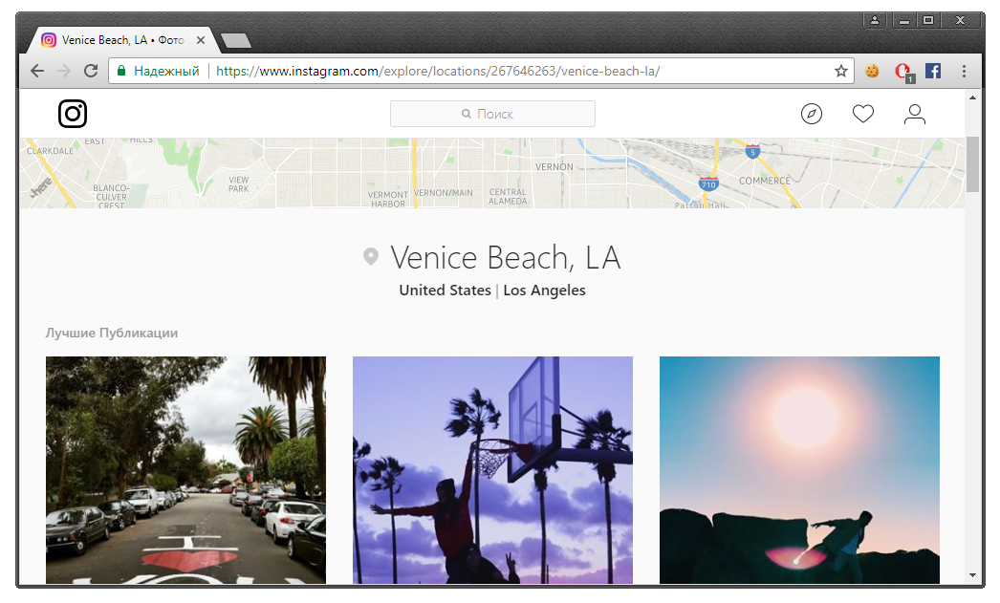
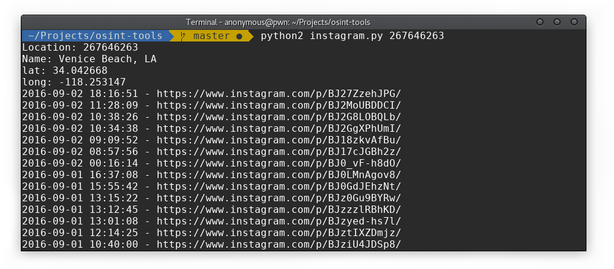

# OSINT Tools

## instagram.py

This tool allows to parse all photos by specific location (count of locations is limited) from instagram. Default instagram API doesn`t allow to do it, but there is another one GraphQL API that allows. 

Firstly, you should find **id** of location from this list: https://www.instagram.com/explore/locations/

For example, **Venice Beach, Los Angeles**:

In URL there will be **id** parameter. So, **id** for Venice Beach is **267646263**. Now we can run the script:

